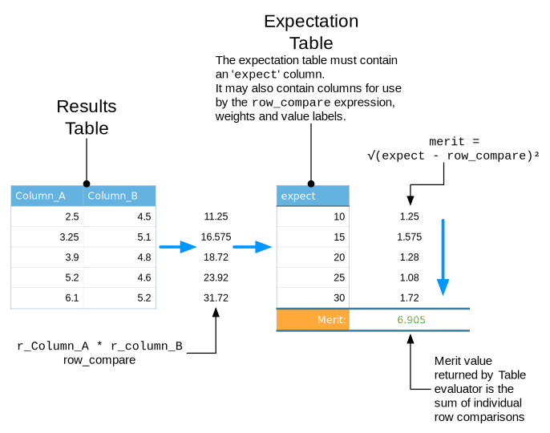

.. _pprofit-evaluators:

##########
Evaluators
##########

Evaluators are responsible for extracting values from a job's output. Typically the difference between a property's value predicted for a particular set of candidate potential parameters is compared with a desired value, such as an experimental value. Evaluators return large values when the goodness of fit between the predicted and desired properties are poor and smaller values when a better solution is obtained.

Evaluators are attached to jobs meaning that evaluator configuration should appear in ``job.cfg`` files. Evaluator configuration blocks have the following basic format::

	[Evaluator:EVALUATOR_NAME]
	type : EVALUATOR_TYPE
	...

Each block starts with ``[Evaluator:EVALUATOR_NAME]`` where ``EVALUATOR_NAME`` is a label used to refer to the evaluated values produced by this evaluator and is used within the :ref:`pprofitmon` and by :ref:`pprofit-metaevaluators` to identify each evaluator. For this reason each block needs to have a unique ``EVALUATOR_NAME`` for a particular job (although names can be re-used within different jobs).

``type : EVALUATOR_TYPE`` identifies the evaluator to be applied to job output following completion. Several evaluators are provided with Potential Pro-Fit and they can be selected by setting ``EVALUATOR_TYPE`` to their name. The ``type`` field is then followed by fields specific to each evaluator, these are documented with respect to each evaluator below.

Evaluator Reference
===================

.. _pprofit-evaluators-DLPOLY_STATIS:

DLPOLY_STATIS
^^^^^^^^^^^^^

:Type-Name: ``DLPOLY_STATIS``

:Description: Evaluator for extracting property time averages from the STATIS files created by the `DL_POLY <http://www.stfc.ac.uk/CSE/randd/ccg/software/DL_POLY/25526.aspx>`_ molecular dynamics code.

By default the evaluator takes the average of a property value over an entire STATIS file and returns the weighted root mean squared difference between this average and a desired value. If the :ref:`start_time <pprofit-evaluators-DLPOLY_STATIS-start_time>` field is specified, then the average will be taken from this time to the end of the STATIS file.

.. _pprofit-evaluators-DLPOLY_STATIS-fielddescription:

Field Descriptions
------------------

The general format of ``DLPOLY_STATIS`` fields is::

	FIELD_NAME : EXPECTED_VALUE [WEIGHT]

:``FIELD_NAME``: Name of field to define (e.g. ``engcns``)
:``EXPECTED_VALUE``: Desired field value. RMS difference will be calculated as root of squared difference between this value and the average extracted from ``STATIS`` file.
:``WEIGHT``: The RMS difference between extracted and expected values is multiplied by ``WEIGHT`` to obtain the merit-value for the evaluator record. ``WEIGHT`` is optional and if not specified, a value of 1.0 will be used.

Field definition example
""""""""""""""""""""""""
To fit to a volume of 1000.0 and give it a weight of 5.0 the following could be used:: 

	volume : 1000.0 5.0

Example
-------
The the following example could be to create and evaluator named "DL_POLY" within a ``job.cfg`` file. This is suitable for fitting to a volume of 1000.0 and cell angles of 90.0, 60.0 and 120.0 degrees. Note the weight on the volume has been used to bring its merit-values into a simlar range as those for the cell angles::

	[Evaluator:DL_POLY]
	type   : DLPOLY_STATIS
	volume : 1000.0 0.1
	alpha  : 90.0
	beta   : 60.0
	gamma  : 120.0

General Fields
--------------
.. _pprofit-evaluators-DLPOLY_STATIS-start_time:

:Name: ``start_time``
:Arg Type: float
:Description: If specified, averages are extracted from STATIS file from ``start_time`` onwards.
	If this field does not appear then averages are calculated for the entire ``STATIS`` file.

STATIS Fields
-------------

:Name: ``alpha`` 
:Description: Simulation box angle alpha.

\ 

:Name: ``beta`` 
:Description: Simulation box angle beta.

\ 

:Name: ``engang`` 
:Description: Valence angle and 3-body potential energy.

\ 

:Name: ``engbnd`` 
:Description: Chemical bond energy.

\ 

:Name: ``engcfg`` 
:Description: Configurational energy.

\ 

:Name: ``engcns`` 
:Description: Total extended system energy (i.e. the conserved quantity).

\ 

:Name: ``engcpe`` 
:Description: Electrostatic energy.

\ 

:Name: ``engdih`` 
:Description: Dihedral, inversion, and 4-body potential energy.

\ 

:Name: ``engshl`` 
:Description: Core-shell potential energy.

\ 

:Name: ``engsrp`` 
:Description: Short-range potential energy.

\ 

:Name: ``engtet`` 
:Description: Tethering energy.

\ 

:Name: ``enthal`` 
:Description: Enthalpy (total energy + PV).

\ 

:Name: ``gamma`` 
:Description: Simulation box angle gamma.

\ 

:Name: ``msd_SPECIES``
:Description: Extract mean squared displacement (MSD) for species named ``SPECIES`` from STATIS.
:Example: ``msd_Li : 6.0``

	This would expect a mean squared displacement value of 6.0 for Li atoms within the system. 

\ 

:Name: ``press`` 
:Description: Pressure.

\ 

:Name: ``stressxx`` 
:Description: xx component of stress tensor.

\ 

:Name: ``stressxy`` 
:Description: xy component of stress tensor.

\ 

:Name: ``stressxz`` 
:Description: xz component of stress tensor.

\ 

:Name: ``stressyx`` 
:Description: yx component of stress tensor.

\ 

:Name: ``stressyy`` 
:Description: yy component of stress tensor.

\ 

:Name: ``stressyz`` 
:Description: yz component of stress tensor.

\ 

:Name: ``stresszx`` 
:Description: zx component of stress tensor.

\ 

:Name: ``stresszy`` 
:Description: zy component of stress tensor.

\ 

:Name: ``stresszz`` 
:Description: zz component of stress tensor.

\ 

:Name: ``temp`` 
:Description: Temperature.

\ 

:Name: ``tmprot`` 
:Description: Rotational temperature.

\ 

:Name: ``tmpshl`` 
:Description: Shell temperature.

\ 

:Name: ``vir`` 
:Description: Total virial.

\ 

:Name: ``virang`` 
:Description: Valence angle and 3-body virial.

\ 

:Name: ``virbnd`` 
:Description: Bond virial.

\ 

:Name: ``vircon`` 
:Description: Constraint bond virial.

\ 

:Name: ``vircpe`` 
:Description: Electrostatic virial.

\ 

:Name: ``virpmf`` 
:Description: PMF constraint virial.

\ 

:Name: ``virshl`` 
:Description: Pressure.

\ 

:Name: ``virsrp`` 
:Description: Short-range virial.

\ 

:Name: ``virtet`` 
:Description: Tethering virial.

\ 

:Name: ``volume`` 
:Description: Simulation box volume.

Additional Fields for NPT Runs
------------------------------
The following fields can only be used for DL_POLY jobs using NPT/NST thermodynamics ensembles.

:Name: ``cella_x``
	
	``cella_y`` 

	``cella_z``
	
	``cellb_x``
	
	``cellb_y``
	
	``cellb_z``
	
	``cellc_x``
	
	``cellc_y``
	
	``cellc_z``
:Description: x, y or z components of simulation cell a,b and c vectors.

.. _pprofit-evaluators-gulp:

Gulp
^^^^

:Type-Name:  ``Gulp``
:Description: Parses values from output of the `GULP <https://projects.ivec.org/gulp/>` simulation code.

GULP is a powerful simulation code allowing various types of simulation run to be performed. This evaluator extracts values from GULP output. In common with other evaluators most fields take the form::

	FIELD_NAME : EXPECTED_VALUE [WEIGHT]

See description :ref:`above <pprofit-evaluators-DLPOLY_STATIS-fielddescription>` for detailed explanation of ``FIELD_NAME``, ``EXPECTED_VALUE`` and ``WEIGHT``.

.. note::

	Although a single GULP input file can contain multiple input structures, this evaluator will only extract values from the output of the first of these configurations.

Required Fields
---------------

:Name: ``filename``
:Arg type: string
:Description: Name of file within job directory containing GULP output.
:Example: If your job's ``runjob`` script directed Gulp output into ``output.res`` you would use the following field definition:
	
	``filename : output.res``

Other Fields
------------

:Name: ``cell_alpha``

	``cell_beta``

	``cell_gamma``
:Description: Fields specifying simulation cell angles: alpha, beta and gamma.

\ 

:Name: ``cell_a``

	``cell_b``

	``cell_c``
:Description: Simulation a,b and c cell vector lengths.

\ 

:Name: ``elastic_c11``, ``elastic_c12``, ``elastic_c13``, ``elastic_c14``, ``elastic_c15``, ``elastic_c16``

	``elastic_c21``, ``elastic_c22``, ``elastic_c23``, ``elastic_c24``, ``elastic_c25``, ``elastic_c26``

	``elastic_c31``, ``elastic_c32``, ``elastic_c33``, ``elastic_c34``, ``elastic_c35``, ``elastic_c36``

	``elastic_c41``, ``elastic_c42``, ``elastic_c43``, ``elastic_c44``, ``elastic_c45``, ``elastic_c46``

	``elastic_c51``, ``elastic_c52``, ``elastic_c53``, ``elastic_c54``, ``elastic_c55``, ``elastic_c56``

	``elastic_c61``, ``elastic_c62``, ``elastic_c63``, ``elastic_c64``, ``elastic_c65``, ``elastic_c66``
:Description: Members of the elastic constant tensor.

\ 

:Name: ``lattice_energy``
:Description: Final system energy following optimisation.

\ 

:Name: ``lattice_energy_at_start``
:Description: System energy before optimisation.

\ 

:Name: ``negative_phonon_penalty``
:Description: Evaluates to 1.0 if negative phonon frequencies are detected. Otherwise returns 0.0. This field is useful for imposing a penalty to systems that yield unphysical negative phonon frequencies.
:Notes: Ensure that the GULP ``phon`` keyword is specified in GULP input.
:Example: Apply a penalty of 100.0 when negative phonons detected:

	``negative_phonon_penalty : 100.0``

\ 

:Name: ``optimisation_penalty``
:Description: Evaluates to 1.0 if energy minimisation ends with a status other than "Optimisation achieved". Otherwise returns 0.0. This field is useful for imposing a penalty to systems that :may fail to optimise but may otherwise yield good, if spurious, matches to expected propety values.
:Example: Apply a penalty of 100.0 (i.e. multiply bad optimisation value of 1.0 by weight of 100.0) when optimisation run fails:
	``optimisation_penalty : 100.0``

\ 

:Name: ``bulkmodulus_hill``, 

	``bulkmodulus_reuss``, 

	``bulkmodulus_voigt``
:Description: Evaluates to RMS differences betwen Hill, Reuss and Voigt versions of the bulk modulus.

\ 

:Name: ``shearmodulus_hill``,

	``shearmodulus_reuss``,

	``shearmodulus_voigt`` 
:Description: Evaluates using Hill, Reuss and Voigt versions of the shear modulus.

Gulp_DRV
^^^^^^^^

:Type-Name: ``Gulp_DRV``
:Description: Parses cell and atom derivatives from .drv files generated by GULP ``output drv ...`` command. Fitting to derivatives can greatly speed merit-value evaluation as it can avoid structural optimisation steps.

.. note::

	In order for the ``Gulp_DRV`` evaluator to work, make sure that your GULP file uses the ``prop`` keyword on its first line which triggers a derivative calculation. Further, make sure your GULP input file contains a command dumping a .drv file (e.g. ``output drv out.drv``).

Required Fields
---------------

:Name: ``filename``
:Description: Name of file from which to extract values.

Other Fields
------------

:Name: ``atom_gradients``
:Description: Sum of the magnitude of force vectors acting on atoms in the system. Value of field parameter is used as weight for this value.

\

:Name: ``cell_gradients``
:Description: Sum of root-squared differences between all components of cell derivative matrix and zero. Field parameter is used as weighting factor.

\

:Name: ``cell_xx``

	``cell_yy``

	``cell_zz``

	``cell_yz``

	``cell_xz``

	``cell_xy``
:Description: Calculates root-squared difference between individual components of cell derivative matrix and zero. Value provided as input to these fields is weighting factor.
:Example: ``cell_xx 10.0``. Fit to cell derivative acting along x-axis and give value a 10.0 weighting factor.

\

Regex
^^^^^

:Type-Name: ``Regex``
:Description:  Extracts values from output files based on regular expression patterns.

Required Fields
---------------

:Name: ``filename``
:Description: Name of file from which to extract values.

Regular Expression Fields
-------------------------

The general form regular expression fields is (square brackets represent optional fields)::

	EVALUATED_VARIABLE_NAME : /REGEX/ EXPECTED_VALUE [WEIGHT [MATCHGROUP[:FILE_INSTANCE]]]

Where:

	* ``EVALUATED_VARIABLE_NAME`` : Name of extracted value as it appears to meta-evaluators and the fitting monitor.

	* ``REGEX`` : Regular expression. The python regular expression engine is used see `python regular expression documentation <http://docs.python.org/2/library/re.html>`_ for details on valid expressions. The regex should contain at least one capturing group. On a match, the group is converted to a floating point value.

	* ``EXPECTED_VALUE`` : Value with which matched value will be compared. In order to form merit value, weighted RMS difference between ``EXPECTED_VALUE`` and matched value is used.

	* ``WEIGHT`` : Weighting to be applied to RMS difference with ``EXPECTED_VALUE``. Default: 1.0.

	* ``MATCHGROUP`` : Integer giving the number (starting at 1) of the regex capture group to be used for match. By default ``MATCHGROUP = 1``.

	* ``FILE_INSTANCE`` : Integer giving the number (starting at 1) of times the regular expression should match file contents before an evaluator record is generated. So a value of 2 would indicate that the second instance of a match should be used as the evaluator value. By default ``FILE_INSTANCE = 1``.

Examples
""""""""

To create an evaluator record named ``A`` that would match lines beginning ``VARIABLE:`` returning the value after the ``:`` and expecting a value of 10.0, the following evaluator could be defined for an output file named ``output.txt``::

	[Evaluator:regex] 
	type : Regex
	filename : output.txt
	A : /^VARIABLE: (.*)/ 10.0

To additionally specify a weighting factor of 2.0 the following could be used::

	[Evaluator:regex] 
	type : Regex
	filename : output.txt
	A : /^VARIABLE: (.*)/ 10.0 2.0

Within the following example, the regular expression contains two capture groups, to use the value within the second group this could be specified::

	[Evaluator:regex] 
	type : Regex
	filename : output.txt
	A : /^VARIABLE: (.*?) (.*)/ 10.0 1.0 2

To find the second occurence of this regular expression then the evaluator definition could be modified as follows::

	[Evaluator:regex] 
	type : Regex
	filename : output.txt
	A : /^VARIABLE: (.*)/ 10.0 1.0 2:2

.. _pprofit-evaluators-table:

Table
^^^^^
:Type-Name: ``Table``
:Description:  Compares tabular data. A table of expected results is provided in a CSV file and is compared with a results CSV file generated by a job. The evaluator calculates a merit value through row by row comparison of the expect and results tables.

    The Table evaluator accepts CSV formatted files with a header row. The expectation table contains an ``expect`` column whilst the results table is generated by the job associated with the evaluator. The evaluator's merit value is calculated by applying the ``row_compare`` expression (in this example ``Column_A * ColumnB``) to the two tables, one row at a time. The root, squared difference between the ``row_compare`` and ``expect`` values are then summed and weighted to produce the the evaluator's merit value.

Required Fields
---------------

:Name: ``expect_filename``
:Arg Type: string
:Description: File name of CSV file containing expectation values for this evaluator. Path is specified relative to job directory.

\

:Name: ``results_filename``
:Arg Type: string
:Description: Path to results table CSV file. This is given relative to job output directory. The job should create a CSV formatted file, with a header row. The columns of of the results table map on to the ``r_VARNAME`` variables used within the ``row_compare`` expression. 

\

:Name: ``row_compare``
:Arg Type: string
:Description: This field defines a mathematical expression that is evaluated for each row and compared to the contents of the ``expect`` column within the expectation table (if the ``expect_value`` option is used then this value is used instead of the ``expect`` column values). The merit value for each row is given as the square root of the squared difference between ``expect`` and ``row_compare``. 

  Values from both the expectation and results tables can be used within expressions by using an `e_` or `r_` prefix respectively:
  
    * ``e_COLUMN`` defines expect variables:
      
      * e.g. ``e_X``  within an expression would take values from the ``X`` column of the expectation table.
      
    * ``r_COLUMN`` defines results variables:
   
      * e.g. ``r_Y`` represents the ``Y`` column from the results table.

  A more complete description of the functions and operators supported for expressions is given in :ref:`expression-syntax`.
  
:Example: A fitting run has been created in which atomic positions, resulting from an energy minimisation are compared to an experimental structure. The minimisation job has been configured to output the minimised structure as a CSV file (``minimised.csv``) containing the columns ``X``, ``Y`` and ``Z`` for the relaxed cartesian coordinates. These positions are compared to a file named ``structure.csv`` containing the experimental coordinates in the same order as they appear in ``minimised.csv``. The ``structure.csv`` file also contains the columns ``X``, ``Y`` and ``Z`` in addition to a column ``expect``. The ``expect`` column contains a value of 0.0 for each row (for reasons that will become apparent below).

  The following extract from a ``job.cfg`` file shows how the ``Table`` evaluator can be used to compare the predicted and experimental structures::
  
    [Evaluator:Structure]
    type : Table
    expect_filename : structure.csv
    results_filename : minimised.csv
    row_compare : sqrt((e_X - r_X)^2 + (e_Y - r_Y)^2 + (e_Z - r_Z)^2)
    
  The ``row_compare`` expression calculates the magnitude of the separation vector between the coordinates in the expectation and results tables. For a perfect match, this magnitude would be 0.0. As the values in the ``expect`` column are all zero the merit value for each row in the tables is obtained by comparing the magnitude with zero. The ``Table`` evaluator will therefore give the smallest merit values to structures that most closely match experiment.

\

Optional Fields
---------------
:Name: ``expect_value``
:Arg Type: float
:Description: If specified the value of ``expect_value`` is compared with values evaluated using ``row_compare`` rather than value in the ``expect`` column of the expectation table.

	If specified the expectation table **does not need to contain an** ``expect`` **column**.
\

:Name: ``label_column``
:Arg Type: string
:Description: By default the result of each row comparison are labelled according the row index (e.g. ``row_0, row_1, row_2, ... row_n``). The ``label_column`` option can be used to provide more descriptive labels.

	The ``label_column`` field value specifies a column within the expectation table. For each row comparison the value of this column is used as the row label prefix. 

:Example: ``label_column : label`` 
	Specifies the ``label`` column from the expectation table. When used with the following table these row names would be obtained.
	
	* **Row 0:** ``Oxygen_0``
	* **Row 1:** ``Titanium_1``
	* **Row 2:** ``Lanthanum_2``

		=  =  =  ======  =========
		A  B  C  expect   *label* 
		=  =  =  ======  =========
		0  1  2      10  Oxygen
		2  3  4      11  Titanium
		5  6  7       9  Lanthanum
		=  =  =  ======  =========

\

:Name: ``sum_only``
:Arg Type: boolean
:Default: ``False``
:Description: Setting ``sum_only`` to ``True`` causes this evaluator to generate a single record  containing the sum of each row comparison between the expectation and results table.

	By default ``sum_only`` is ``False``, meaning that the ``Table`` evaluator emits an evaluator record for each comparison between the expectation and results table. These give the root squared difference between the value in the expectation table's ``expect`` column and the value obtained by evaluating the ``row_compare`` expression. In addition an evaluator record named ``table_sum`` is returned containing the sum of these values.

	In certain cases having a large number of row-comparison values may be confusing. Setting ``sum_only`` can therefore be useful in reducing the amount of data stored in the ``fitting_run.db`` file and appearing in the ``pprofitmon`` GUI.
:Example: ``sum_only : True``

	Would mean that a single record, giving the sum of the row comparison values, would be generated by the ``Table`` evaluator. 

	``sum_only : False``

	Causes the evaluator to generate one record for every row in the expectation table. In addition a record named ``table_sum`` is created with a weight of 0.0, giving the sum of weighted merit values obtained from each row comparison.

\

:Name: ``weight``
:Arg Type: float
:Default: 1.0
:Description: Weighting factor for merit values calculated by this evaluator. The behaviour of this option is changed when it is used in conjunction with ``sum_only`` and ``weight_column`` options. 

	* If ``weight_column`` is ``True``:

		- The merit-value for each row comparison between expectation and results tables is multiplied by the value in the column named ``weight_column``. 
		- If ``sum_only`` is ``True``, the sum of these row merit values is calculated to give the ``table_sum`` evaluator record. **This sum is then multiplied by the value given by the** ``weight`` **option** (i.e. ``weight`` is applied to the sum and not to each row's merit-value).  
		- If ``sum_only`` is ``False``, then ``weight`` is applied to each row's merit-value in addition to the value from the ``weight_column``.

	* As a result, by specifying a ``weight`` of 0.0. The evaluator can effectively be turned off. The values will still be reported to ``pprofitmon`` and can be used in meta-evaluators but will not contribute to the global merit-value.

\

:Name: ``weight_column``
:Arg Type: string
:Description: Specifies a column within the expect table. When given, the values from the column are used to weight the merit-value calculated for each row comparison.
:Note: Following weighting by ``weight_column`` the merit-value is further multiplied the value given by the ``weight`` field. 

