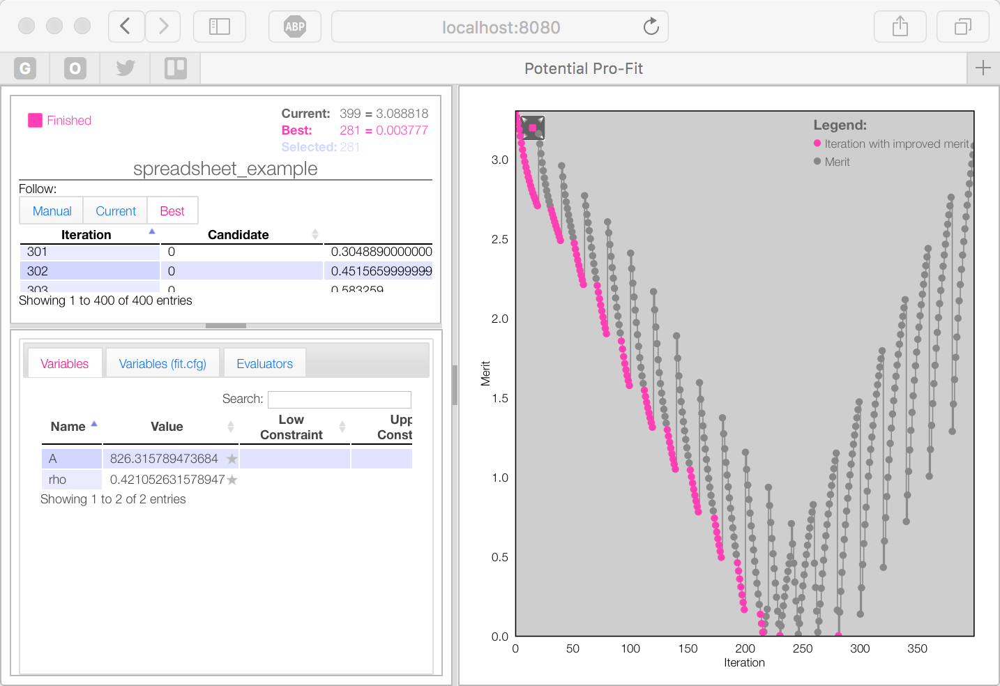

.. _examples_spreadsheet_example:

Example Using the Spreadsheet Minimiser
=======================================

The following example shows how to use the `Spreadsheet minimiser <pprofit-minimizers-spreadsheet>`_ to systematically explore parameter space when potential space. The example aims to reproduce the method used by Read and Jackson to derive their 2010 potential set for UO\ :sub:`2` `doi:10.1016/j.jnucmat.2010.08.044 <http://dx.doi.org/10.1016/j.jnucmat.2010.08.044>`_ [Read2010]_.

Description of Problem
----------------------

Read and Jackson wanted to fit a U-O potential suitable for use with a previously derived O-O interaction employing the four-range Buckingham potential form (Buck-4). Due to the absence of a stationary point the Buck-4 description, the Buckingham potential had previously been employed to describe the U-O cation anion interaction:

  .. math::
  
    V_{\text{U-O}}(r_{ij}) = A \exp\left( - \frac{\rho}{r_{ij}} \right) - \frac{C}{r_{ij}^6}

Where :math:`V_{\text{U-O}}(r_{ij})` is the energy of two ions :math:`i` and :math:`j` separated by :math:`r_{ij}` and :math:`A`, :math:`\rho` and :math:`C` are parameters specific to the U-O interaction. 

A limitation of the Buckingham form is that, at small separations, it is prone to the so-called Buckingham catastrophe, whereby the attractive :math:`C/r_{ij}^6` term can overwhelm the repulsive exponential term. This can lead to a highly unphysical attraction which will ultimately cause atoms to collapse on to each other and subsequent failure of the simulation.

In order to overcome this limitation Jackson and Read deleted the :math:`C/r_{ij}^6` term. They then performed a systematic search of :math:`A` and :math:`\rho` values that were still able to provide a reasonable description of the UO\ :sub:`2` structure without using a :math:`C` term. The example will now show how ``pprofit`` can be used with the Spreadsheet minimiser (see :ref:`Spreadsheet minimizer <pprofit-minimizers-spreadsheet>`\ ) to perform the same search.

Worked Example
--------------

The example will now demonstrate the following:

1. Initialise fitting run.
2. Setting up ``GULP`` energy minimisation:

  * Create job directory.
  * Create input files to perform energy minimisation using fitting variables.
  * Edit ``job.cfg`` to use the :ref:`Gulp Evaluator <pprofit-evaluators-gulp>` to obtain quality of lattice constant predicted using fitting parameters against experimental value.

3. Create ``fit.cfg`` to perform systematic :math:`A` and :math:`\rho` parameter search:

  * Define ``[Variables]`` section.
  * Set-up the ``[Minimizer]`` section to use ``Spreadsheet`` minimizer.  

4. Analyse the results in :ref:`GNUPLOT <gnuplot_analyse>` or `R`_.

Initialise Fitting Run
^^^^^^^^^^^^^^^^^^^^^^
Create the skeleton of a ``pprofit`` run by typing the following in a terminal::

  pprofit --init spreadsheet_example

* This will create a directory named ``spreadsheet_example``.
* Go into the ``spreadsheet_example`` directory:

  ::

    cd spreadsheet_example

* Within the directory you will find a basic ``fit.cfg`` file and an empty ``fit_files/`` directory. 

Create ``GULP`` Job
^^^^^^^^^^^^^^^^^^^

* We will set-up a simple perfect lattice energy minimization that makes use of the ``GULP`` code. The aim of this will be to compare the lattice constant predicted for a UO\ :sub:`2` cell  for different U-O :math:`A` and :math:`\rho` values against an experimentally determined value. In so doing we will be possible to see which values give the best fit to the experimental structure.
* Initialize a new job named ``Gulp_UO2`` by typing the following command within the ``spreadsheet_example`` folder:
  
  ::

    pprofit --init-job Gulp_UO2
  
* This will create a directory named ``Gulp_UO2`` within ``fit_files``, this should contain a skeleton ``job.cfg`` and non-functional ``runjob`` file.
* At this point the ``job.cfg`` file is configured to use the ``Template`` job factory (see :ref:`Template Job Factory <pprofit-jobfactories-template>`) and the ``Local`` runner defined, by default, in the ``fit.cfg`` file.

* **Create input.gin.in:**

  * Create a file named ``input.gin.in`` within the ``fit_files/Gulp_UO2`` directory. 
  * It is important that the file has the ``.in`` suffix, as this indicates to the ``Template`` job-factory that it contains place-holders which should be replaced by fitting variable values.
  * Edit the file to have the following content (this defines a simple ``GULP`` lattice minimisation job for the UO\ :sub:`2` structure):
  
    .. literalinclude:: spreadsheet_example/fit_files/Gulp_UO2/input.gin.in

  * Note that the parameters for the U-O ``buck`` potential definition at the end of the file have been replaced by ``@A@`` and ``@rho@`` place-holders, indicating where the values of fitting variables should be inserted. In a moment, we will define these variables in the ``[Variables]`` section of the ``fit.cfg`` file.
  
* **Edit runjob:**

  * In order to tell ``pprofit`` how to run our ``GULP`` file we need to edit the ``runjob`` file.
  * Edit ``runjob`` to have the following contents:
  
    .. literalinclude:: spreadsheet_example/fit_files/Gulp_UO2/runjob
    
  
  * This states that ``gulp`` should take a file named ``input.gin``  and create an output file named ``output.gout``. **Note:** the ``.in`` suffix is dropped from ``input.gin.in`` to produce ``input.gin`` during template processing.
  * If your ``gulp`` binary is not on your path, or had a non standard name, this can also be specified within ``runjob``.

* **Create an Evaluator in job.cfg to extract relaxed lattice constant from output.gout**:

  * We will now define a ``GULP`` evaluator with the ``job.cfg`` file (see :ref:`Gulp evaluator <pprofit-evaluators-gulp>`).
  * This is used to extract the lattice constant from the ``output.gout`` file generated by ``GULP``.
  * This is compared against an experimentally determined value of 5.468Å.
  * The squared difference between the calculated and experimental values defines the merit-value for the fitting run. 
  * Edit ``job.cfg`` to contain:
  
    .. literalinclude:: spreadsheet_example/fit_files/Gulp_UO2/job.cfg
 

Set-up ``fit.cfg``
^^^^^^^^^^^^^^^^^^

Before being able to run ``pprofit`` it is necessary to make some changes to the ``fit.cfg`` file located in the root, ``spreadsheet_example`` folder.

* **Define [Variables]:** The first job is to define variables for the ``@A@`` and ``@rho@`` placeholders used within our ``input.gin.in`` file.
  
  * Edit the ``fit.cfg`` file and scroll to the ``[Variables]`` section and then edit it so that it reads::
  
      [Variables]
      A   : 1.0 *
      rho : 1.0 *
      
      
  * Although variable values of 1.0 are specified, these are not used during the ``pprofit`` run, as variable values will be read from the spreadsheet being used to drive the run.
  * Note that the ``*`` at the end of the variable definitions indicate that both are optimisation variables. 

* **Create Spreadsheet:**

  * The original Jackson and Read paper surveyed the following ranges: :math:`750 \leq A \leq 2200`\ eV and :math:`0.2 \leq \rho \leq 0.5`\ Å [Read2010]_\ . These ranges have also been adopted for the present example. 
  * To support the spreadsheet minimiser, the :ref:`ppgrid` tool is provided. This allows CSV formatted grids to be generated that sample a given range with a given grid-resolution. In order to create a 20⨉20 grid with the required ranges and write this into a file names ``spreadsheet.csv`` use the following command
  
    .. code-block:: bash

      ppgrid --range A:750,2200,20  rho:0.2,0.5,20 -o spreadsheet.csv
    

  * (Alternatively you can download the :download:`spreadsheet_example/spreadsheet.csv` file and place it in the same directory as ``fit.cfg``).

* **Set-Up Spreadsheet Minimizer:** ``pprofit`` needs to be told to read variables from a spreadsheet.

   
  * Find the ``[Minimizer]`` section of ``fit.cfg`` and edit it such that it reads::

      [Minimizer]
      type : Spreadsheet
      filename : spreadsheet.csv
      

Run ``pprofit``
^^^^^^^^^^^^^^^

* You should now have all the files you need for a fitting run. 
* From the directory containing ``fit.cfg`` type the following::

    pprofit
    
* In order to monitor the progress of your run, open a separate terminal and run the monitor::

    pprofitmon
    
* Having invoked ``pprofitmon`` go to http://localhost:8080 in your web browser. As the run proceeds the plot will have the appearance shown in the following figure.

	Following the ``pprofit`` run the monitor will look something like this. The merit function vs iteration plot has a serrated appearance with each serration being due to the minimizer passing over a group of entries in the ``spreadsheet.csv`` file representing a single row in the grid specified to the ``ppgrid`` tool.

Analysing the results
---------------------

The ``fitting_run.db`` file created during the ``pprofit`` run now contains property values evaluated at each node of the grid we created earlier. Due to the structure inherent in the grid the ``ppdump`` command can be used to extract the properties of interest in a format that is suitable for plotting in commonly used analysis packages. In the following part of these instructions, we will plot the difference between the predicted and experimental lattice calculated for UO\ :sub:`2` against the A and ϱ potential parameters surveyed. This will give a plot equivalent to figure 9 in the original Read and Jackson paper.

.. _gnuplot_analyse:

GNUPLOT
^^^^^^^

In the first instance, `GNUPLOT`_  will be used to provide the 3D plot of lattice parameter difference  against A and ϱ. 

* As the data in ``fitting_run.db`` has resulted from a grid created ``ppgrid`` it is possible to use the ``ppdump`` command to extract data in a format suitable for use with the `GNUPLOT`_ ``splot`` commands. 

* The ``ppdump`` requires value keys to identify which variable should be used for the x, y and z columns of the plot. Type:
	
	.. code:: bash

		ppdump --list-variable-columns

* This results in, a list of two keys for the two fitting variables specified in the original ``fit.cfg`` ::

		variable:A
		variable:rho

* Similarly, to find the evaluator key needed, type:
	
	.. code:: bash

		ppdump --list-evaluator-columns

* This gives the list::

		evaluator:Gulp_UO2:Gulp_UO2:Lattice_Constant:cell_a:extracted_value
		evaluator:Gulp_UO2:Gulp_UO2:Lattice_Constant:cell_a:merit_value
		evaluator:Gulp_UO2:Gulp_UO2:Lattice_Constant:cell_a:percent_difference

* We will use the raw value extracted from the GULP runs, namely::

	evaluator:Gulp_UO2:Gulp_UO2:Lattice_Constant:cell_a:extracted_value

* Using these column keys a GNUPlot formatted file can be created:

	.. code:: bash

		ppdump --grid GNUPlot 	--gridx  variable:A --gridy  variable:rho --gridz  evaluator:Gulp_UO2:Gulp_UO2:Lattice_Constant:cell_a:extracted_value -o gnuplot.dat

* This arranges the A and rho values along the x and y axes respectively and lattice constant along z. The ``--grid`` option specifies that the data should be written in gnuplot's ``splot`` format and ``-o gnuplot.dat`` states that it should be saved to the file named ``gnuplot.dat``.

* This file can now be plotted in GNUPlot. Within GNUPlot type the following::

	set hidden3d
	set xlabel "A"
	set ylabel "rho"
	set zlabel "LP diff"
	set view 64,250,1,1
	splot 'gnuplot.dat' using ($1):($2):($3-5.468) with lines title "diff"

* The third component of the ``using`` statement from the previous step deserves some explanation. ``($3-5.468)`` means that a value of 5.468 is subtracted from the z values contained in the ``gnuplot.dat`` data file. As 5.468Å is the experimental lattice parameter for UO\ :sub:`2` this allows the difference between predicted and experimental lattice parameters to be plotted. You should obtain something that looks like the followin figure:

	.. figure:: images/splot.png
		:align: center

		Plot of lattice parameter difference between experimental and predicted values.

* We are particularly interested in identifying the potential parameters that exactly match the experimental lattice parameter. This zero contour can be quickly visualised within GNUPlot. Type the following commands into GNUPlot::
	
	set hidden3d
	set xlabel "A"
	set ylabel "rho"
	set zlabel "LP diff"
	set view 64,250,1,1
	set contour base
	set cntrparam levels discrete 0
	splot 'gnuplot.dat' using ($1):($2):($3-5.468) with lines title "diff"
\ 

	.. figure:: images/splot_with_zero_contour.png
		:align: center

		The difference surface shown with the zero contour plotted in green on the base of the plot.

* This contour is more usefully viewed from above (``set view 0,0``), to give a 2D plot of the potential parameters giving the best fit to experiment::

	set xlabel "A"
	set ylabel "rho"
	set zlabel "LP diff"
	set view 0,0
	set contour base
	set cntrparam levels discrete 0
	unset surface
	splot 'gnuplot.dat' using ($1):($2):($3-5.468) with lines title "diff"
\ 

	.. figure:: images/splot_2d_contour_plot.png
		:align: center

		The contour from the previous step describes a function that links the A and rho potential parameters which should give a perfect match to the experimental lattice parameter of 5.468Å.

* Normally it isn't enough for a potential model to only reproduce the structure's lattice parameter. Often we want to get good reproduction of properties such as bulk modulus whilst still maintaining the lattice parameter. Let's obtain an analytical expression for the zero contour using GNUPlot's features. This expression could then be used in a subsequent fitting run as a constraint, ``pprofit`` can be used to search along this line to find the A and rho values that give a perfect match to lattice parameter and the best match for other properties too.

    - The zero contour can be dumped into a data file using these GNUPlot commands::

    	set contour base
    	set cntrparam levels discrete 0
    	unset surface
    	set table 'contours.dat'
    	splot 'gnuplot.dat' using ($1):($2):($3-5.468) with lines title "diff"
    	unset table
\ 

    - This creates a file named 'contours.dat' containing points along the zero contour:
    	.. literalinclude:: resources/contours.dat

    - This can be plot using the commands::

    	set xlabel "A"
    	set ylabel "rho"
    	plot "contours.dat"
\ 
		
		.. figure:: images/contour_plot.png
			:align: center

			Plot of the 'contours.dat' file.

	- GNUPlot's ``fit`` command can now be used to perform a least-squares fit to the data. To fit a polynomial :math:`\rho(A) = a*A^2 + b*A + c` type the following into GNUPlot::

		f(x) = a*x**2 + b*x + c
		a = 1
		b = 1 
		c = 1
		fit f(x) 'contours.dat' using 1:2 via a,b,c

	- The a,b and c quadratic parameters can be extracted from the output of the fit command:

	    + a = 1.49022e-06
	    + b = -0.00571639
	    + c = 5.68292

		.. figure:: images/contour_plot_with_fit.png
			:align: center

			Plot of 'contours.dat' with quadratic fit.

	- A constrained fit could then be made with a modified ``fit.cfg``, where  ``rho`` becomes a :ref:`calculated variable <pprofit-variables-calculatedvariables>` which is linked to ``A`` through the quadratic function. 

		.. literalinclude:: resources/constrained_fit.cfg

	- All that remains to make the constrained fit would be to add the necessary evaluators to the ``job.cfg`` files, allowing extra property values to be extracted from the GULP output.

R
^

.. _GNUPLOT: http://www.gnuplot.info

.. [Read2010] S.D. Read and R.A. Jackson, "Derivation of enhanced potentials for uranium dioxide and the calculation of lattice and intrinsic defect properties" *Journal of Nuclear Materials* **406** (2010) 293. 