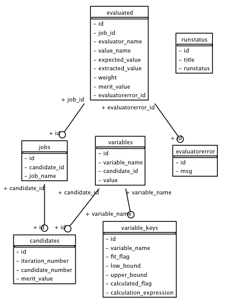

**************
fitting_run.db
**************

During a fitting run, :ref:`pprofit` creates an `sqlite <http://sqlite.org>`_ database named ``fitting_run.db`` into which job and evaluator information are reported during a fitting run. 

Under normal use end-users do not need to directly access this file and should instead use :ref:`pprofitmon`. Advanced users may want to perform additional monitoring or analysis, for this reason the format of `fitting_run.db` is now described. 

Database Structure
==================

    Entity diagram for ``fitting_run.db``. This diagram was obtained by introspecting database schema and can be generated using the following command: ``python -m atomsscripts.fitting.drawschema schema.png``.

Tables
^^^^^^

:Name: ``candidates``
:Description: Contains candidate solutions generated during fitting runs. Each candidate represents a set of variable values that were evaluated during the fitting run. This table is a hub linking a specific population member and run iteration number to the jobs (and indirectly evaluator values) to fitting variables. It is important to note that, to support population based minimisers, each iteration can have multiple candidates. 
:Fields: 

	:id: Unique candidate identifier.
	:iteration_number: Iteration for solution (iteration numbered from zero).
	:merit_value: Merit value obtained for candidate solution.

\

:Name: ``evaluated``
:Description: Contains values extracted from jobs by :ref:`evaluators <pprofit-evaluators>`.
:Fields:

	:id: Unique identifier for evaluator record.
	:job_id: Foreign key for ``id`` within ``jobs`` table. Used to join evaluator values to jobs from which they were extracted.
	:evaluator_name: Name of evaluator generating value. This takes the form of ``JOB:EVALUATOR`` where ``JOB`` is the job name and ``EVALUATOR`` the evaluator label within that job.
	:value_name: Value name returned by evaluator as listed in :ref:`evaluator reference <pprofit-evaluators>`.
	:expected_value: Float expected for this value.
	:extracted_value: Value extracted by evaluator for this record.
	:weight: Weighting factor.
	:merit_value: Value passed by evaluator to merit function.
	:evaluatorerror_id: Foreign key for ``id`` within ``evaluatorerror`` table. In case of evaluator errors, error message appears in that table.

\

:Name: ``evaluatorerror``
:Description: Contains description of errors generated during invocation of evaluators.
:Fields:

	:id: Unique identifier for error.
	:msg: Error message.

\

:Name: ``jobs``
:Description: Links candidate solutions to their jobs and associated evaluator records.
:Fields:

	:id: Unique job identity.
	:candidate_id: Foreign key for ``id`` within ``candidates`` table.
	:job_name: Name of job. This maps onto the directory name to which this record belongs within fitting run's ``fit_files`` directory.

\

:Name: ``runstatus``
:Description: Contains single records giving current status of fitting run.
:Fields:

	:id: Id.
	:runstatus: One of 'Running', 'Finished' or 'Error'.
	:title: Title of the fitting run. This field reflects contents of ``title`` field within ``[FittingRun]`` section of configuration.

\

:Name: ``variable_keys``
:Description: Contains static description of each variable. Contains variable name, bounds and, for calculated variables, the calculation expression.
:Fields:

	:id: Unique identifier for a variable value.
	:variable_name: Label identifying variable.
	:fit_flag: Boolean indicating whether this variable is changed during fitting.
	:low_bound: Lower value for variable limit or undefined.
	:upper_bound: Upper value for variable limits or undefined.
	:calculated_flag: Boolean flag indicating if this variable is a :ref:`calculated variable <pprofit-variables-calculatedvariables>`.
	:calculation_expression: For calculated variables gives the formula used to obtain variable value.

\

:Name: ``variables``
:Description: Contains variable values.
:Fields:

	:id: Unique identifier for variable value.
	:variable_name: Foreign key for ``variable_name`` in ``variables`` table.
	:candidate_id: Foreign key for ``id`` in ``candidates`` table. Allows this value to be linked to the candidate solution to which it belongs.

Example Queries
===============

This section contains a number of SQL queries that are useful for use with the ``fitting_run.db`` database. Queries can be tested using the command line ``sqlite`` or ``sqlite3`` tool. For instance to show the contents of the ``variable_keys`` table the following could be used (``sqlite>`` indicates prompt within ``sqlite3`` tool)::

	$ sqlite3 fitting_run.db

	sqlite> select * from variable_keys;

Example 1: get number of final iteration
^^^^^^^^^^^^^^^^^^^^^^^^^^^^^^^^^^^^^^^^

::

	SELECT max(candidates.iteration_number) AS max_iteration 
	FROM candidates;

Example 2: find best ever candidate within database
^^^^^^^^^^^^^^^^^^^^^^^^^^^^^^^^^^^^^^^^^^^^^^^^^^^
Can be used to obtain the smallest ever merit value and its ``candidate_number`` and ``iteration_number``::
	
	SELECT candidates.id, 
		candidates.candidate_number, 
		candidates.iteration_number, 
		min(candidates.merit_value) AS merit_value 
	FROM candidates;

Example 3: find best candidate within each iteration/generation
^^^^^^^^^^^^^^^^^^^^^^^^^^^^^^^^^^^^^^^^^^^^^^^^^^^^^^^^^^^^^^^
For a ``fitting_run.db`` obtained using a population based minimiser obtain the minimum ``merit_value`` from each iteration. This could be useful for plotting the the evolution of ``merit_value`` as a function of minimisation step::

	SELECT candidates.iteration_number, 
		min(candidates.merit_value) AS merit_value
	FROM candidates 
	GROUP BY candidates.iteration_number;

Example 4: find variable definitions and values for given ``candidate_number`` and ``iteration_number``
^^^^^^^^^^^^^^^^^^^^^^^^^^^^^^^^^^^^^^^^^^^^^^^^^^^^^^^^^^^^^^^^^^^^^^^^^^^^^^^^^^^^^^^^^^^^^^^^^^^^^^^
For a given pair of ``candidate_number`` and ``iteration_number``, such as those obtained using query in example 2, obtain  variable definitions and values.

If ``candidate_number = 0`` and ``iteration_number = 5`` then query would be::

	SELECT variable_keys.variable_name, 
		variable_keys.fit_flag, 
		variable_keys.low_bound, 
		variable_keys.upper_bound, 
		variable_keys.calculated_flag, 
		variable_keys.calculation_expression, 
		variables.value 
	FROM variable_keys, 
		variables, 
		candidates 
	WHERE variable_keys.variable_name = variables.variable_name 
		AND variables.candidate_id = candidates.id 
		AND candidates.iteration_number = 5 
		AND candidates.candidate_number = 0;

Example 5: obtain evaluator records for a particular candidate 
^^^^^^^^^^^^^^^^^^^^^^^^^^^^^^^^^^^^^^^^^^^^^^^^^^^^^^^^^^^^^^
For a particular candidate id (maybe obtained using query from example 2) select evaluator records. Here candidate id is 1::
	
	SELECT evaluated.evaluator_name, 
		evaluated.value_name, 
		evaluated.expected_value, 
		evaluated.extracted_value, 
		evaluated.weight, 
		evaluated.merit_value, 
		evaluatorerror.msg AS error_message, 
		jobs.job_name 
	FROM evaluated 
	JOIN jobs ON evaluated.job_id = jobs.id 
	LEFT OUTER JOIN evaluatorerror ON evaluated.evaluatorerror_id = evaluatorerror.id 
	WHERE jobs.candidate_id = 1