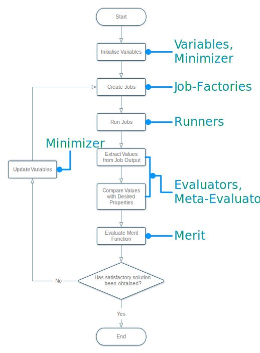

*****************
Potential Pro-Fit
*****************

Potential Pro-Fit is a system designed to facilitate parameter optimisation for the potentials models for use with classical simulation codes. This should be used with :ref:`pprofitmon` which is used monitor and analyse fitting results.

    Flow chart showing the basic process performed by Potential Pro-Fit . The blue text indicate how entities within the fitting systems relate to the different stages in the cycle.

Contents
=========
.. toctree::
  :maxdepth: 3 
    
  pprofit
  pprofitmon/pprofitmon
  configuration
  examples/examples
  fittingrundb
  sshlogin   
  acknowledgements
