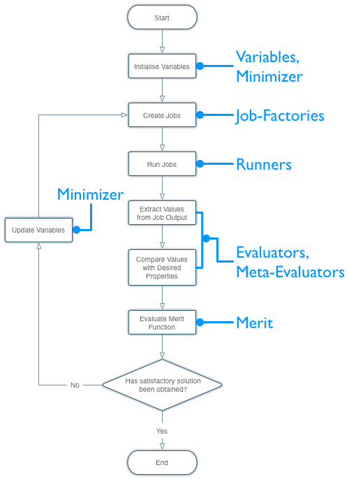

.. _fittingTool:
**************
fittingTool.py
**************

The `fittingTool.py` is a system designed to facilitate parameter optimisation for the fitting of pair potentials. This should be used with :ref:`fittingTool_monitor.py <fittingToolMonitor>` which is used monitor and analyse fitting results.

    Flow chart showing the basic process performed by ``fittingTool.py``. The blue text indicate how ``fittingTool.py`` ientities relate to the different stages in the cycle.

Usage
=====

::

	Usage: fittingTool.py [OPTIONS]  

	fittingTool.py performs an automated potential fitting run in the current directory. See documentation for description of required directory structure and files.

	Options:
	  -h, --help            show this help message and exit
	  -v, --verbose         use verbose logging

	  Run options:
	    -s JOB_DIR, --single-step=JOB_DIR
	                        using the values from fit.cfg evaluate the merit
	                        function and store job files in JOB_DIR
	    -c JOB_DIR, --create-files=JOB_DIR
	                        create job files but do not run or perform evaluation.
	                        Jobs are created in JOB_DIR

	  Initialisation:
	    Options for creating fitting runs and jobs

	    -i RUN_DIR, --init=RUN_DIR
	                        create directory named RUN_DIR and initialize
	                        directory structure for new fitting run.
	    -j JOB_NAME[:RUNNER], --init-job=JOB_NAME[:RUNNER]
	                        create skeleton of a new job using 'Template' job
	                        factory, within fit_files directory. Job directory
	                        will be named JOB_DIRECTORY. Optionally, RUNNER can be
	                        specified. This gives name of runner (defined in
	                        fit.cfg) to be associated with created JOB. If not
	                        specified, first runner within 'fit.cfg' will be used.

Reference
=========
.. toctree::
    
    configuration
    fittingrundb
    acknowledgements
    bugs
