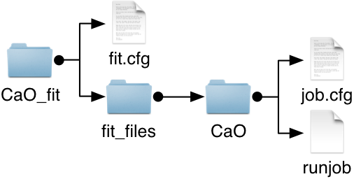

.. _fittingtools-jobfactories:

#############
Job-Factories
#############

Job factories are responsible for creating jobs. This involves combining the contents of a job directory within the ``fit_files`` sub-directory with a set of variables produced by the :ref:`minimizer <fittingtool-minimizers>`, creating a job-instance whose ``runjob`` script can be invoked by a :ref:`runner <fittingtool-runners>`. 

Job factories are configured within each job's ``job.cfg`` file and th job factory is selected within the ``[Job]`` block of this configuration file::

	[Job]
	type : FACTORY_TYPE
	...

Where ``FACTORY_TYPE`` the name of a job-factory as listed in :ref:`fitting-tool-jobfactories-reference`.

.. _fittingtool-jobfactories-reference:

Job Factory Reference
=====================

.. _fittingtool-jobfactories-template:

Template
^^^^^^^^

:Name: Template
:Description: Creates job files by performing variable substitution on text files containing variable placeholders (i.e. template substitution). 

	Only files with a name ending in ``.in`` undergo template substitution. The ``.in`` file is dropped from the substituted file (i.e. a file named ``jobfile.in`` becomes ``jobfile`` on creation of a job instance). 

Template Format
---------------

Variable placeholders take the following format::

	@VARIABLE_NAME@

Where ``VARIABLE_NAME`` is a variable name from the ``[Variables]`` section of the ``fit.cfg`` file. On substitution, ``@VARIABLE_NAME@`` would be replaced with the variable value.

Example
-------

The following example shows how the ``Template`` job factory can be used to define potentials for a GULP job.

The ``[Variables]`` section of the ``fit.cfg`` file is defined as (see :ref:`fittingtool-variables` for more information)::

	[Variables]
	morse_Ca_O_A : 0.030211 *
	morse_Ca_O_B : 2.241334 *
	morse_Ca_O_C : 2.923245 *
	lennard_Ca_O_A : 5.0 
	#
	morse_Mg_O_A : 0.038908 
	morse_Mg_O_B : 2.281000 
	morse_Mg_O_C : 2.586153 
	lennard_Mg_O_A : 5.0 
	#
	morse_O_O_A : 0.042395 
	morse_O_O_B : 1.379316 
	morse_O_O_C : 3.618701 
	lennard_O_O_A : 22.0 

A job named CaO is defined within the following folder structure:

The ``Template`` job factory is configured within the CaO ``job.cfg`` which has the following contents::

	[Job]
	type : Template
	runner : Local

	[Evaluator:Gulp]
	type : Gulp
	filename : output.res
	cell_a : 4.811 10.0
	cell_b : 4.811 10.0
	cell_c : 4.811 10.0		

Information regarding the ``runner`` and ``[Evaluator]`` configuration options can be found :ref:`here <fittingtool-runners>` and :ref:`here <fittingtool-evaluators>`.

For completeness the contents of the ``runjob`` file is shown here::

	#! /bin/bash

	gulp < CaO.gp3 > output.res	

The ``CaO.gp3.in`` file contains the template placeholders and its contents is::

	conp opti phon prop

	name Structure 1

	cell
	4.8107200000 4.8107200000 4.8107200000 90.0000000000 90.0000000000 90.0000000000

	cartesian
	Ca 0.0000000000 0.0000000000 0.0000000000
	Ca 0.0000000000 2.4053600000 2.4053600000
	Ca 2.4053600000 0.0000000000 2.4053600000
	Ca 2.4053600000 2.4053600000 0.0000000000
	O 0.0000000000 0.0000000000 2.4053600000
	O 0.0000000000 2.4053600000 0.0000000000
	O 2.4053600000 0.0000000000 0.0000000000
	O 2.4053600000 2.4053600000 2.4053600000

	morse
	Ca O @morse_Ca_O_A@ @morse_Ca_O_B@ @morse_Ca_O_C@ 0.0 20.0 
	O O  @morse_O_O_A@ @morse_O_O_B@ @morse_O_O_C@ 0.0 20.0 

	lennard
	Ca O @lennard_Ca_O_A@ 0.0 0.0 20.0 
	O O  @lennard_O_O_A@ 0.0 0.0 20.0 

	species
	Ca  1.2
	O  -1.2

From this it can be seen where the variable values are inserted to form a valid GULP input file. Following the first iteration of the fitting run, the contents of the ``CaO.gp3`` file created from this template would be::

	conp opti phon prop

	name Structure 1

	cell
	4.8107200000 4.8107200000 4.8107200000 90.0000000000 90.0000000000 90.0000000000

	cartesian
	Ca 0.0000000000 0.0000000000 0.0000000000
	Ca 0.0000000000 2.4053600000 2.4053600000
	Ca 2.4053600000 0.0000000000 2.4053600000
	Ca 2.4053600000 2.4053600000 0.0000000000
	O 0.0000000000 0.0000000000 2.4053600000
	O 0.0000000000 2.4053600000 0.0000000000
	O 2.4053600000 0.0000000000 0.0000000000
	O 2.4053600000 2.4053600000 2.4053600000

	morse
	Ca O 0.030211 2.241334 2.923245 0.0 20.0 
	O O  0.042395 1.379316 3.618701 0.0 20.0 

	lennard
	Ca O 5.0 0.0 0.0 20.0 
	O O  22.0 0.0 0.0 20.0 

	species
	Ca  1.2
	O  -1.2
