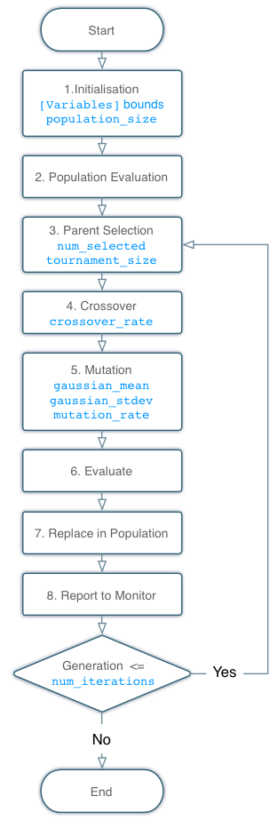

.. _pprofit-minimizers:

##########
Minimizers 
##########

Minimizers are the entities within Potential Pro-Fit responsible for choosing candidate parameter sets and iteratively optimising them to minimize an objective function. In simpler terms, the minimizer gradually changes an initial set of input variables to improve the property predictions yielded by the potential set.

A single minimizer is configured for each fitting run within the ``fit.cfg`` file by specifying a ``[Minimizer]`` block. This must, as a minimum, specify a ``type`` field selecting the minimizer and any other field required by a particular minimizer (see :ref:`pprofit-minimizers-reference`). For example the :ref:`NelderMead <pprofit-minimizers-neldermead>` minimizer can be selected in this way::

  [Minimizer]
  type : NelderMead

.. _pprofit-minimizers-reference:

Minimizer Reference
-------------------

.. _pprofit-minimizers-DEA:

DEA
^^^

:Type-Name: DEA
:Description: Minimizer based on the `differential evolution algorithm <http://en.wikipedia.org/wiki/Differential_evolution>`_ of Storn and Price. 

Algorithm Description
=====================

  Flowchart showing operation of the differential evolution algorithm. Configuration options and the stage of the algorithm that they affect are indicated in blue. 

  1. **Initialisation:** Fitting parameters bounds read from ``[Variables]`` section of the ``fit.cfg`` (see :ref:`pprofit-variables`). A list of candidate solutions ``population_size`` in length is initialised by randomly selecting parameter values uniformly from interval defined by these bounds.

  2. **Population Evaluation:** Merit function is used to calculate fitness values for each candidate solution within population.

  .. note:: If a merit value of NaN is obtained (maybe due to an error condition in an evaluator) during population evaluation, this solution will be dropped from the population for the remainder of the minimisation run leading to a population size less than ``population_size``.

  3. **Parent Selection:** New candidates are generated by performing crossover between pairs of parent solutions extracted from the existing population. Parents are selected using `tournament selection <http://en.wikipedia.org/wiki/Tournament_selection>`_. This proceeds as follows:
        * ``tournament_size`` candidates are selected from population at random.
        * candidate with the lowest merit value is kept.
        * tournament is repeated until ``num_selected`` candidates have been selected for crossover. 

  4. **Crossover:** The previous step generates ``num_selected`` parents. Mothers are extracted as the even numbered members of this list whilst fathers are the odd numbered solutions. For each mother/father pair two offspring are generated. Crossover occurs with the probability defined by the ``crossover-rate`` parameter (when crossover is not performed, parents are passed directly to next step). The crossover algorithm is as follows:
        * offspring values are obtained by taking the value of the parent with the best merit values and adding the difference between mother and father values weighted by a random number (between 0 and 1) to create offspring value.
        * for each fitting parameter within candidates:
            - if mother has lowest merit value then offspring values = :math:`m + r(m-f)`
            - if father has lowest merit value then offspring values = :math:`f - r(m-f)`
            - Where:
                + :math:`m` = mother parameter value
                + :math:`f` = father parameter value
                + :math:`r` = random number between 0 and 1.

  5. **Mutation:** for each fit parameter within the offspring generated in the previous step gaussian mutation is performed with the probability defined by the ``mutation_rate`` parameter. Mutation is performed by selecting a value at random from a gaussian distribution centred at ``gaussian_mean`` and ``gaussian_stdev`` and adding to the parameter.
  6. **Evaluate Offspring:** The merit function is used to evaluate the new offspring. 
  7. **Replace in Population:** The offspring replace the least fit (higher merit value) individuals in the existing population, even if those offspring are less fit than the individuals that they replace.
  8. **Report to Monitor:** Population is archived to ``fitting_run.db`` database and reported to ``pprofitmon`` if running.

.. note::
  This minimizer wraps the DEA implementation provided within the `inspyred library <http://inspyred.github.com>`_ . If you use this minimizer please acknowledge inspyred.

Optional Fields
===============
:Name: crossover_rate
:Arg-type: float
:Default: 1.0
:Bounds: 0.0-1.0
:Description: Probability with which crossover should take place.

\ 

:Name: gaussian_mean
:Arg-type: float
:Default: 0.0
:Description: Mean of gaussian distribution used during mutation.

\

:Name: gaussian_stdev
:Arg-type: float
:Default: 1.0
:Description: Standard deviation of gaussian distrubtion used during mutation.

\

:Name: max_iterations
:Arg-type: int
:Default: 1000
:Description: Terminate optimisation after this number of iterations.

\

:Name: mutation_rate
:Arg-type: float
:Default: 0.1
:Bounds: 0.0-1.0
:Description: Probability that offspring fit parameter will undergo gaussian mutation.

\

:Name: num_selected
:Arg-type: int
:Default: 2
:Bounds: >=2
:Description: Number of parents and hence offspring selected during tournament selection.

\

:Name: population_size
:Arg-type: int
:Default: 64
:Bounds: >=2
:Description: Size of population.

\

:Name: random_seed
:Arg-type: int
:Default: current time
:Description: Random seed used during optimisation.

\

:Name: tournament_size
:Arg-type: int
:Default: >=2
:Description: Number of candidates randomly selected from population during tournament selection of parents before crossover.

.. _pprofit-minimizers-neldermead:

NelderMead
^^^^^^^^^^

:Type-Name: NelderMead
:Description: This minimizer uses the `Nelder-Mead algorithm <http://en.wikipedia.org/wiki/Nelder%E2%80%93Mead_method>`_ (also known as the downhill simplex method).

\ 

.. note::
  The NelderMead minimizer as implemented here, makes use of the `mystic framework <http://dev.danse.us/trac/mystic>`_ that is part of the `DANSE project <http://danse.us/trac/all/wiki>`_. If you use this minimizer please acknowledge this work through the following references:

  * M.M. McKerns, L. Strand, T. Sullivan, A. Fang and M.A.G. Aivazis, "Building a framework for predictive science", *Proceedings of the 10th Python in Science Conference*, 2011. http://arxiv.org/pdf/1202.1056

  * Michael McKerns, Patrick Hung, and Michael Aivazis, "mystic: a simple model-independent inversion framework", 2009- ; http://dev.danse.us/trac/mystic

Variable Bounds
===============

The ``NelderMead`` minimizer has support for constrained optimisation. Variable constraints are defined within the ``[Variables]`` section of the ``fit.cfg`` file (see :ref:`pprofit-variables`). The following gives some examples of how constraints may be specified to the minimizer::

  [Variables]
  A : 1.0 
  B : 1.0 (0.0,)
  C : 1.0 (, 10.0)
  D : 1.0 (0.0, 10.0)

Above, each value has an initial value of 1.0 and the constraints are as follows:
  
  * ``A``: no constraint.
  * ``B``: variable cannot go below 0.0 (no upper bound).
  * ``C``: variable cannot go above 10.0 (no lower bound).
  * ``C`` : variable is restricted to the range :math:`0.0 \leq C \leq 10.0`.

Optional Fields
===============

:Name: function_tolerance
:Arg-type: float
:Default: 0.0001
:Description: Relative error on calculated merit function acceptable for convergence.

\ 

:Name: value_tolerance
:Arg-type: float
:Default: 0.0001
:Description: Relative error on adjustable variable parameters acceptable for convergence.

\ 

:Name: max_iterations
:Arg-type: int
:Default: Unlimited
:Description: Terminate minimization after given number of iterations.

SingleStepMinimizer
^^^^^^^^^^^^^^^^^^^

:Type-Name: SingleStepMinimizer
:Description: Evaluates the merit function once then exits. Using this minimizer is equivalent to specifying the ``--single`` option to ``pprofit``. 

\ 

Optional Fields
===============

:Name: keep-files-directory
:Arg-type: string
:Description: If specified, job files are copied to given directory following run. This can provide useful information for debugging the simulation runs making up a fitting run as job output is retained.

\ 

